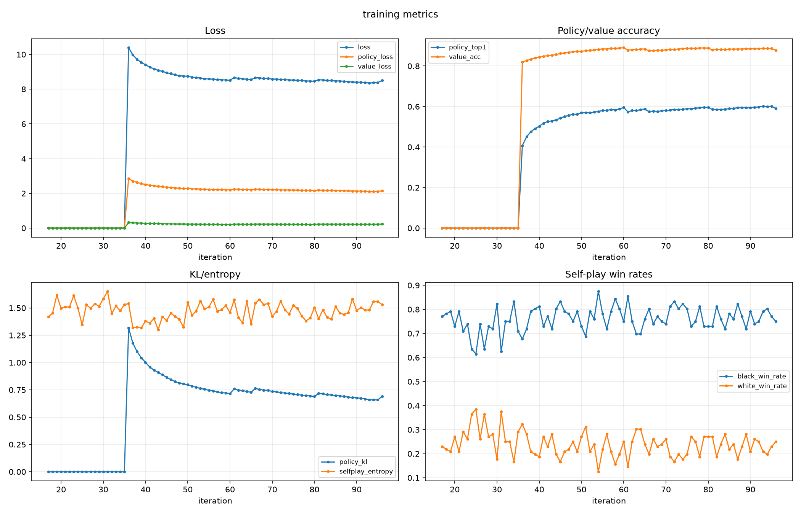
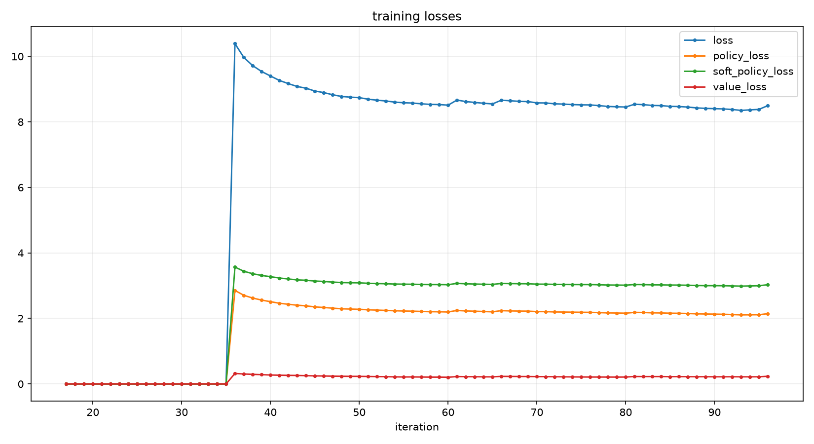
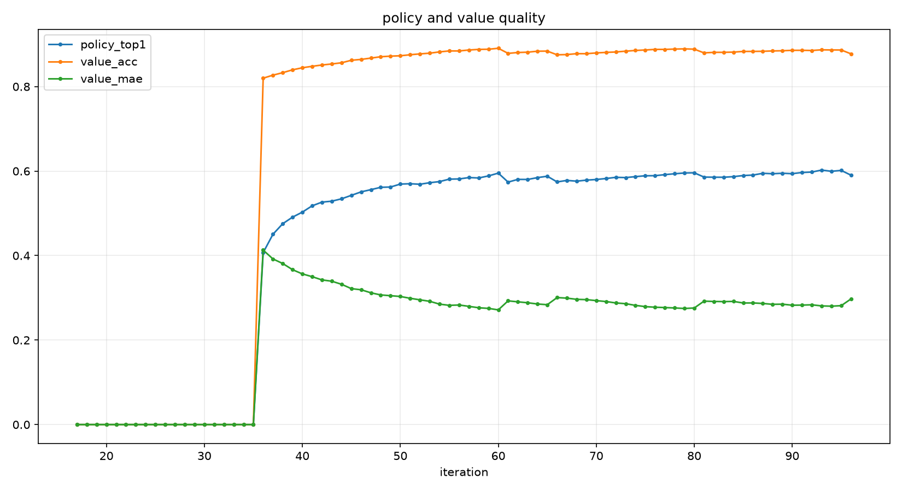
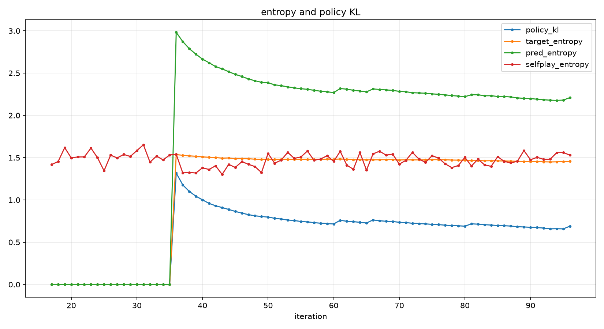
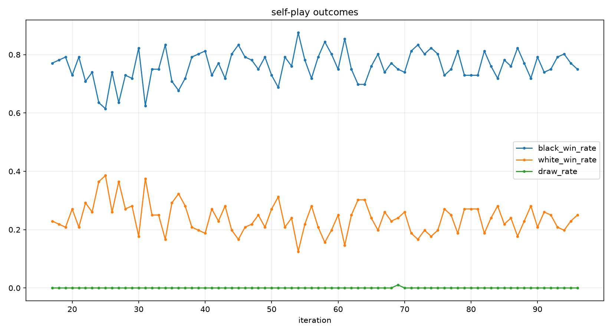
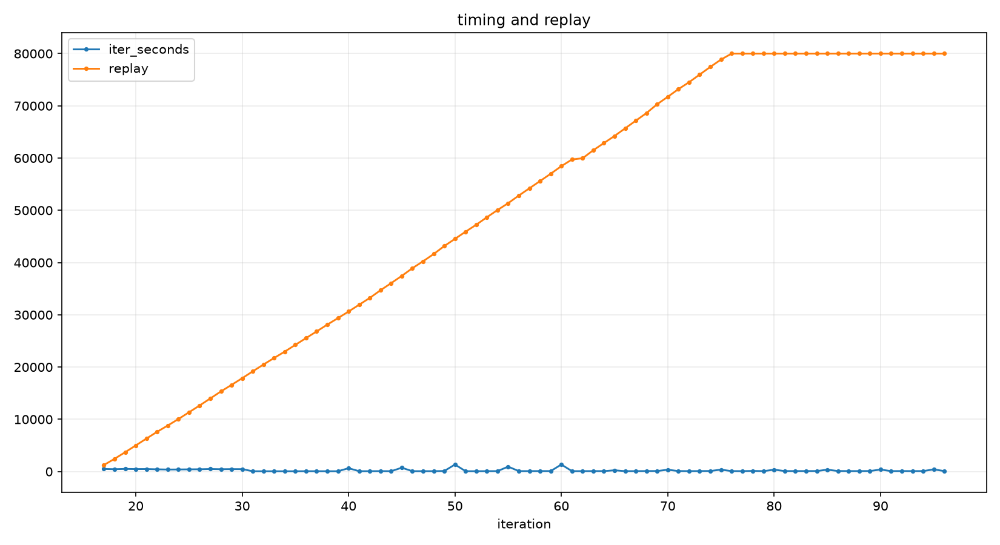

# 10x10 AlphaZero 五子棋

这是一个面向 `10x10` 棋盘的 AlphaZero 风格五子棋项目，包含自我对弈、MCTS 搜索、神经网络训练、checkpoint 评估和 GitHub Pages 静态对弈页面。

旧的后端网页入口已经移除：仓库不再保留 `web/` 和 `web_play.py`，浏览器页面只维护 `docs/` 静态版。

## 当前状态

正式 baseline：

```text
outputs/checkpoints/a100-4-prod-v3/gomoku10_best.pt
```

该模型约 `115 MB`，不随 GitHub 仓库分发，需要作为本地或远端训练产物保存。`a100-4-prod-v3` 是历史目录名；按实验语义它是 `v1 / old best`，不是 v3。

当前主线实验：

```text
v3-student-local
```

真正的 v3 从蒸馏得到的 `128x8` student 出发，再做大规模 self-play RL。最新 A100 训练后，通过内部 gate 的 best 是：

```text
outputs/checkpoints/v3-student-local/gomoku10_best.pt
```

注意：这个 best 对应第 `90` 轮，不是最后保存的 `iter_0096.pt`。

快速对 old best 初筛：

```text
v3_best_iter90 vs old_best
128 sims, 16 games
14 胜 / 2 负 / 0 和
score = 0.875
```

这个结果说明 v3 有希望超过 old best，但正式晋升仍需要更大样本 head-to-head 评估。

## 项目结构

```text
game.py      五子棋规则、状态转移、胜负判断
mcts.py      神经网络引导的 MCTS
model.py     policy-value 网络
train.py     自我对弈、训练、评估、checkpoint 保存
play.py      命令行人机对弈
utils.py     模型和设备工具
scripts/     画图、benchmark、蒸馏、Pages 导出脚本
docs/        GitHub Pages 静态页面和版本记录
tests/       单元测试
outputs/     本地训练产物、metrics、plots
```

## 最新 v3 曲线

数据来源：

```text
outputs/metrics/v3-student-a100-final.jsonl
```

总览：



损失：



策略和值网络：



KL 和熵：



自我对弈胜率：



耗时和 replay：



CSV：

```text
outputs/plots/v3-student-a100-final/metrics.csv
```

简要诊断：

- replay 达到最低门槛后，训练才真正开始。
- 真实训练阶段 loss 和 policy KL 整体下降。
- policy top-1 最高约 `0.60`。
- value accuracy 稳定在约 `0.88`。
- eval 波动较大，不能只靠曲线晋升 checkpoint。
- 当前 v3 best 是第 `90` 轮，第 `96` 轮不是 accepted champion。

## 测试

Windows 本地建议从父目录运行，保证包导入路径正确：

```powershell
cd "C:\Users\Jiaxuan Zou\Documents\GitHub"
$env:PYTHONPATH="C:\Users\Jiaxuan Zou\Documents\GitHub"
& "C:\Users\Jiaxuan Zou\.conda\envs\alphazero-gomoku\python.exe" -m unittest discover -s alphazero_gomoku\tests -t .
```

## 命令行对弈

```bash
python -m alphazero_gomoku.play \
  alphazero_gomoku/outputs/checkpoints/a100-4-prod-v3/gomoku10_best.pt \
  --simulations 256 \
  --human white
```

人类执白后手，AI 执黑先行。

## 画训练曲线

```bash
python alphazero_gomoku/scripts/plot_training_metrics.py \
  --metrics alphazero_gomoku/outputs/metrics/v3-student-a100-final.jsonl \
  --out-dir alphazero_gomoku/outputs/plots/v3-student-a100-final
```

## checkpoint 对战评估

不要只看 loss 曲线晋升模型。正式比较必须做 head-to-head：

```bash
python alphazero_gomoku/scripts/benchmark_checkpoints.py \
  --candidate alphazero_gomoku/outputs/checkpoints/v3-student-local/gomoku10_best.pt \
  --baseline alphazero_gomoku/outputs/checkpoints/a100-4-prod-v3/gomoku10_best.pt \
  --candidate-sims 128,256,512 \
  --baseline-sims 128 \
  --games 64 \
  --opening-moves 4 \
  --device cuda
```

评估时应使用随机开局，并交替黑白。

## GitHub Pages 静态页面

`docs/` 是无需 Python 后端的静态对弈页面。

导出模型：

```powershell
conda run -n alphazero-gomoku python scripts\export_pages_model.py `
  --checkpoint outputs\checkpoints\a100-4-prod-v3\gomoku10_best.pt `
  --out-dir docs\assets\model `
  --chunk-mib 24
```

本地预览：

```powershell
conda run -n alphazero-gomoku python -m http.server 8780 --bind 127.0.0.1 --directory docs
```

打开：

```text
http://127.0.0.1:8780/
```

## 版本记录

简版版本记录：

```text
docs/VERSION_HISTORY.md
```
