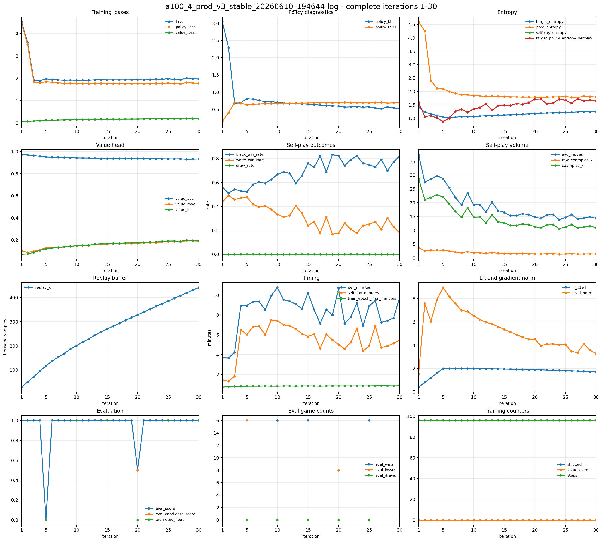
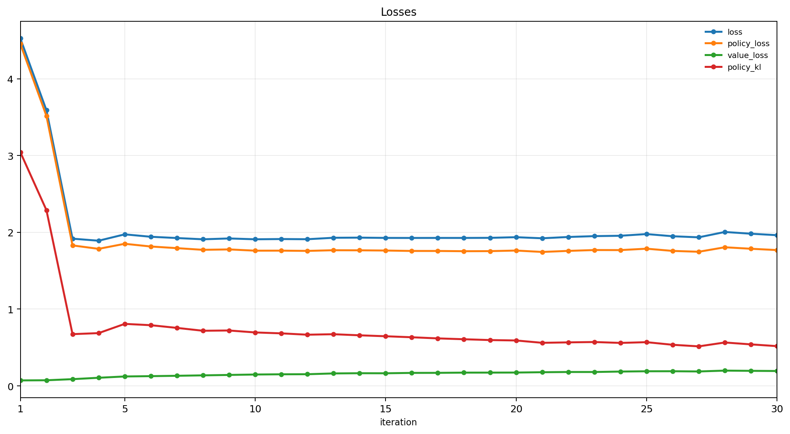
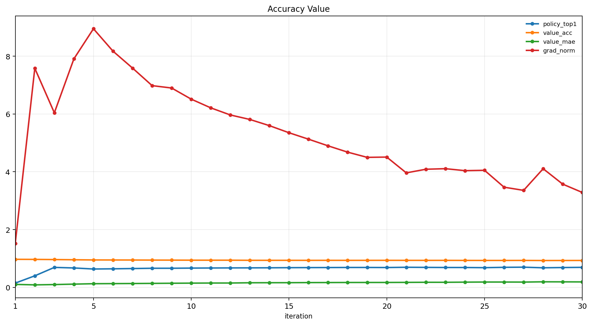
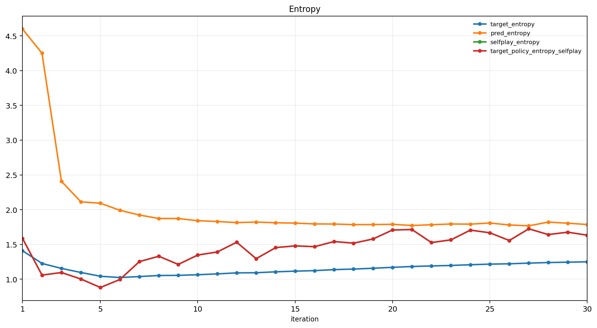
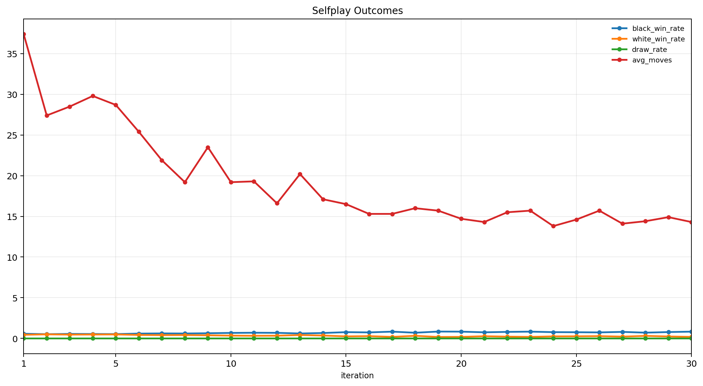
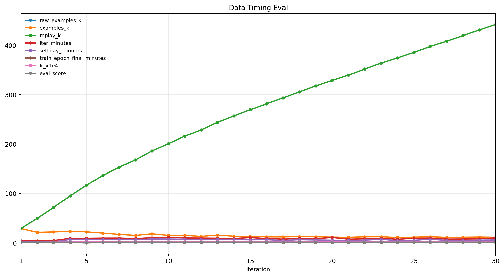
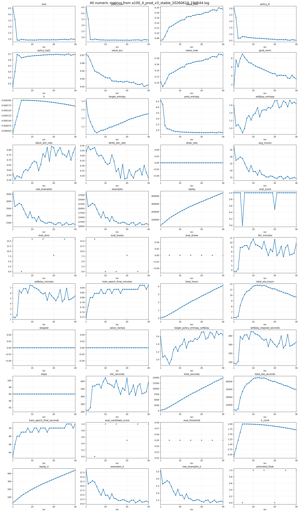

# 10x10 AlphaZero 五子棋

这是一个面向 `10x10` 棋盘的 AlphaZero 风格五子棋训练项目，并移植了多项 [KataGo](https://github.com/lightvector/KataGo) 的训练改进。当前仓库包含训练代码、单元测试、网页对弈界面、训练曲线图，以及最新保留的 checkpoint：

```text
outputs/checkpoints/a100-4-prod-v3/gomoku10_iter_0030.pt
```

项目没有写入开局库、活三活四、威胁搜索或人工估值函数。代码里只编码了五子棋环境规则：

- 棋盘大小为 `10x10`；
- 黑白双方轮流在空位落子；
- 任意方向连成五子即获胜；
- 棋盘下满且无人连五则为平局。

策略和价值都由神经网络从自我对弈中学习。

## 项目结构

```text
game.py        五子棋规则、状态转移和胜负判断
mcts.py        MCTS 搜索（含 KataGo 改进）
model.py       Policy-Value 网络（含全局池化、辅助软策略头）
train.py       自我对弈、训练、评估和 checkpoint 保存
utils.py       公共工具（resolve_device, load_model）
play.py        命令行人机对弈
web_play.py    本地网页对弈服务
web/           前端棋盘界面
tests/         单元测试（规则、MCTS、训练组件）
outputs/       checkpoint、metrics、plots
```

## KataGo 改进

以下改进均可通过 `TrainConfig` 参数独立开关，默认全部关闭以保持向后兼容。`a100-4` 预设会全部开启。

### 神经网络

| 改进 | 参数 | 说明 |
|------|------|------|
| 全局池化 | `use_global_pool` | 残差块内 avg+max 池化 → Linear → 加性通道 bias（KataGo 风格），向每个格子广播全局棋盘信息；`a100-4` 预设用它替代 SE |
| 辅助软策略头 | `use_soft_policy` + `soft_policy_loss_weight` | 第二个 policy head，训练目标 π^(1/T)，权重约 8×，加速学习非最优落点 |

### MCTS

| 改进 | 参数 | 说明 |
|------|------|------|
| 根节点策略温度 | `mcts_root_policy_temp` | 展开根节点前对先验 logits 除以温度，避免先验过早锐化 |
| 形状化 Dirichlet 噪声 | `mcts_shaped_dirichlet` | 先验高于中位数的落点用更高 alpha，更有针对性地探索潜力走法 |
| 动态方差缩放 cPUCT | `mcts_dynamic_cpuct` | `c_puct` 乘以 `sqrt(实证价值方差)`，自适应探索-利用平衡 |
| FPU reduction | `mcts_fpu_reduction` | 未访问子节点估值 = 父节点估值 − fpu·sqrt(已访问先验质量)，替代过于乐观的 Q=0 初始化；**根节点不应用**（对应 KataGo 的 rootFpuReduction）——否则先验遗漏的关键防守点会被永久冻结，搜索宁可对攻也不去试唯一解 |
| 强制访问 + 目标剪枝 | `mcts_forced_playouts` + `mcts_forced_playout_k` | 根节点每个子节点保底 `sqrt(k·prior·N)` 次访问；生成策略目标时剪掉 PUCT 本身不会花的强制访问 |
| 搜索树复用 | `selfplay_tree_reuse` | 自我对弈相邻两步间复用所选子树，节省大量模拟 |

### 自我对弈与训练数据

| 改进 | 参数 | 说明 |
|------|------|------|
| Playout cap randomization | `playout_cap_randomization` + `full_search_prob` + `fast_simulations` | 每步以概率 p 做全量搜索（产生策略目标），否则做小搜索（只产生价值目标），大幅提高自对弈吞吐 |
| 策略目标/温度解耦 | （内置） | 训练目标始终是 τ=1 的访问分布；采样温度只影响实际落子，后期目标不再塌缩成 one-hot |
| 惊喜加权采样 | `surprise_weighting` | 按 KL(无噪声先验‖MCTS目标) 加权 replay 采样，重点训练网络盲区；KL 随 replay 一起持久化 |
| 短期价值目标 | `mcts_value_weight` | `target = (1-w) * 终局胜负 + w * MCTS根节点估值`，降低纯终局标签的高方差 |
| 训练时对称增强 | `augment_symmetries` | 每个 batch 样本独立施加随机二面体对称变换；replay 只存原始局面，同样内存下独立局面多 8 倍 |

## 当前模型

最强模型是 v3 完整训练（100 轮 + KataGo 全套改进）第 95 轮晋升的 champion：

```text
outputs/checkpoints/a100-4-prod-v3/gomoku10_best.pt   (本地, 约 115 MB)
```

它超过 GitHub 单文件 `100 MB` 硬限制，不随仓库提交（`outputs/checkpoints/` 已加入 `.gitignore`）。仓库内保留的 `gomoku10_iter_0030.pt` 是旧版架构的历史模型，仅作存档。

## v3 训练复盘

完整 100 轮训练中踩过并修复的问题，按影响排序：

1. **replay 窗口必须按"原始局面数"换算**：对称增强移到训练时后，沿用旧的 `500k` 容量等于把数据窗口拉长 8 倍、整个 run 永不淘汰旧数据。早期弱模型的自举价值标签（`mcts_value_weight`）成为不可拟合的标签噪声，`value_loss` 从 0.047 单调恶化到 0.116。改为 `80k`（约 50 轮窗口）后止住。
2. **soft policy 权重 8.0 过高**：主干梯度被辅助头主导，梯度范数长期超过裁剪阈值，价值头学习信号被淹没。中途（第 65 轮 checkpoint）把 `soft_policy_loss_weight` 降到 `4.0`、`value_loss_weight` 提到 `1.5` 后，`value_acc` 从 0.85 回升至 0.876，policy_top1 不降反升（最终 0.758）。
3. **根节点 FPU bug**：见上表。实战表现为"对手冲四在前时不堵、反做自己的冲四"，128 sims 复现、修复后同局面 105/128 票回归正解。
4. **评估必须随机化**：确定性搜索下 16 局评估实际只有 2 个不同棋局。随机配对开局（黑白互换）修复后，eval_score 才有梯度信息，early stopping 也才可靠。

最终模型实测（人机对弈）：开局走中心、对活二即开始应对、活三大多会堵、冲四必堵、能组织连续活三 + 连环冲四的成体系进攻；剩余弱点是低模拟数下偶发忽视对手活三，**对弈建议 `--simulations 256` 以上**。

## 快速验证训练循环

从项目父目录运行：

```bash
cd /Users/jiaxuanzou/Documents

python -m alphazero_gomoku.train \
  --iterations 1 \
  --games-per-iteration 1 \
  --simulations 4 \
  --epochs 1 \
  --channels 8 \
  --residual-blocks 1
```

这个命令只用于验证训练流程，不会得到强棋力模型。

## 使用 A100 预设训练

在远端 A100 机器上，从 `~/jiaxuanzou` 运行（自动开启全部 KataGo 改进）：

```bash
cd ~/jiaxuanzou
conda activate modded-nanogpt

python -m alphazero_gomoku.train \
  --preset a100-4 \
  --checkpoint-dir alphazero_gomoku/outputs/checkpoints/a100-4-prod-v3 \
  --replay-path alphazero_gomoku/outputs/replay/a100-4-prod-v3_replay.pt \
  --metrics-path alphazero_gomoku/outputs/metrics/a100-4-prod-v3.jsonl
```

`a100-4` 预设使用更大的 ResNet + 全局池化 + 软策略头、固定每轮训练步数、cosine learning-rate schedule、16 个并行自我对弈 worker，以及全套 KataGo MCTS 和训练改进。

replay 窗口为 `80k` 原始局面（约 50 轮）。注意 replay 现在只存原始局面（对称增强在训练时进行），窗口长度不要按旧版 8 倍增强的尺度设置，否则早期弱模型产生的陈旧价值标签（`mcts_value_weight` 自举部分）会一直留在 buffer 里拖累价值头。

候选模型评估使用随机配对开局：每个随机开局（`eval_opening_moves` 步，默认 2）打两盘、候选模型黑白互换，既消除确定性搜索导致的重复对局，又抵消先手优势。

### Early stopping

自我对弈训练中 loss 走平不代表停滞（数据分布随模型变强而漂移），真正的停滞信号是评估胜率。`early_stop_evals` 设为 `N` 时（`a100-4` 预设为 3），候选模型连续 `N` 次评估打不过 champion 就提前结束训练并保存 replay，避免浪费算力。需要同时开启 `eval_interval` 和 `eval_games`。

配套语义：`gomoku10_best.pt` 在开启评估时只在候选真实晋升时更新（即始终指向 champion 一系的最强模型）；未开启评估时保持旧行为（跟踪最新 checkpoint）。

从已有 checkpoint 继续训练（checkpoint 必须由相同网络架构配置产出；仓库里保留的 `a100-4-prod-v3` 是旧版架构，不能用新预设 resume）：

```bash
python -m alphazero_gomoku.train \
  --preset a100-4 \
  --resume <checkpoint 路径> \
  --checkpoint-dir <相同目录> \
  --replay-path <相同 replay 路径> \
  --metrics-path <相同 metrics 路径>
```

## 命令行对弈

```bash
cd /Users/jiaxuanzou/Documents

python -m alphazero_gomoku.play \
  alphazero_gomoku/outputs/checkpoints/a100-4-prod-v3/gomoku10_iter_0030.pt \
  --simulations 128 \
  --human black
```

行列坐标均从 `1` 开始。

## 本地网页对弈

```bash
cd /Users/jiaxuanzou/Documents

python -m alphazero_gomoku.web_play \
  alphazero_gomoku/outputs/checkpoints/a100-4-prod-v3/gomoku10_iter_0030.pt \
  --simulations 64
```

然后打开：

```text
http://127.0.0.1:8765
```

界面支持悔棋（Undo）和局面分析（Analyze）。

## 训练曲线

下面的图来自 `a100-4-prod-v3` 训练（旧版代码，对应原始日志已从仓库移除）。该日志第 `1-30` 轮有完整的 self-play、train 和 eval summary，因此下图只统计完整的 `1-30` 轮。

### 总览



### 损失曲线



前 3 轮是最明显的学习阶段：总损失从 `4.5253` 降到 `1.9173`，policy loss 从 `4.4537` 降到 `1.8296`，`policy_kl` 也从 `3.0433` 降到 `0.6739`。这说明模型很快从接近均匀策略转向能拟合 MCTS 访问分布的策略。

第 4 轮之后，总损失大多在 `1.9-2.0` 附近波动，而不是继续单调下降。这在自我对弈训练里是正常现象：数据分布会随着模型变强而移动，后续样本并不是固定监督集。

### 策略和值网络指标



`policy_top1` 从第 1 轮的 `0.1480` 快速升到第 3 轮的 `0.6920`，之后基本维持在 `0.68-0.70`。这说明网络对 MCTS 首选落点的拟合已经较稳定。

`value_acc` 从 `0.9715` 缓慢下降到 `0.9323`，`value_mae` 从约 `0.10` 上升到约 `0.19`。这不一定代表训练崩坏，更可能说明后期自我对弈局面更短、更尖锐，胜负标签更集中，价值头面对的分布发生了变化。后续如果要继续增强，应重点观察独立评估胜率，而不是只看 value loss。

### 熵和策略确定性



`pred_entropy` 从 `4.5976` 快速降到约 `1.8`，说明网络输出从接近全棋盘均匀分布变得更集中。与此同时，后期 `target_entropy` 和 `selfplay_entropy` 有所回升，表示 MCTS 目标并不是完全塌缩到单一落点，仍然保留一定搜索分歧。

### 自我对弈结果



平均步数从第 1 轮的 `37.4` 降到第 30 轮的 `14.3`，说明模型越来越快地进入决定性局面。训练集中没有平局，黑棋胜率从约 `0.56` 升到约 `0.82`，白棋胜率对应下降。

这反映了两个信息：

- 模型学到了更直接的胜负线路，棋局明显变短；
- 当前 `10x10` 设置和自我对弈采样下存在很强的先手优势或先手偏置。

如果后续要做更公平的棋力评估，建议固定一组开局、交换先后手，并单独统计黑白胜率。

### 数据量、耗时和评估



replay buffer 从 `28.7k` 增长到 `441.6k` 样本。由于棋局变短，每轮产生的 `raw_examples` 和增强后的 `examples` 后期明显减少。

每轮耗时主要在 `7-10` 分钟之间，自我对弈部分占主要时间。learning rate 在前 5 轮 warmup 到 `2e-4`，之后按 cosine schedule 缓慢下降，到第 30 轮约为 `1.71e-4`。`grad_norm` 在第 5 轮附近达到高点，之后整体下降，说明训练后期更新幅度更稳定。

评估分数大部分为 `1.0`。第 5 轮候选模型评估失败，`eval_score=0.0`；第 20 轮只有 `0.5`，低于晋升阈值；第 30 轮重新达到 `1.0`。这说明训练过程中有少数候选 checkpoint 没有超过 champion，但整体没有出现持续性退化。

### 全部数值指标



解析后的表格保存在：

```text
outputs/plots/a100_4_prod_v3_stable_20260610_194644/metrics_from_log.csv
```

## 测试

从项目父目录运行：

```bash
cd /Users/jiaxuanzou/Documents

python -m unittest discover -s alphazero_gomoku/tests -t .
```

覆盖内容：五子棋规则与终局判定、MCTS 必胜局面与根节点估值符号、策略目标剪枝、树复用、随机对称增强的状态-策略一致性、训练循环边界条件、replay v2 格式与旧格式兼容加载。
