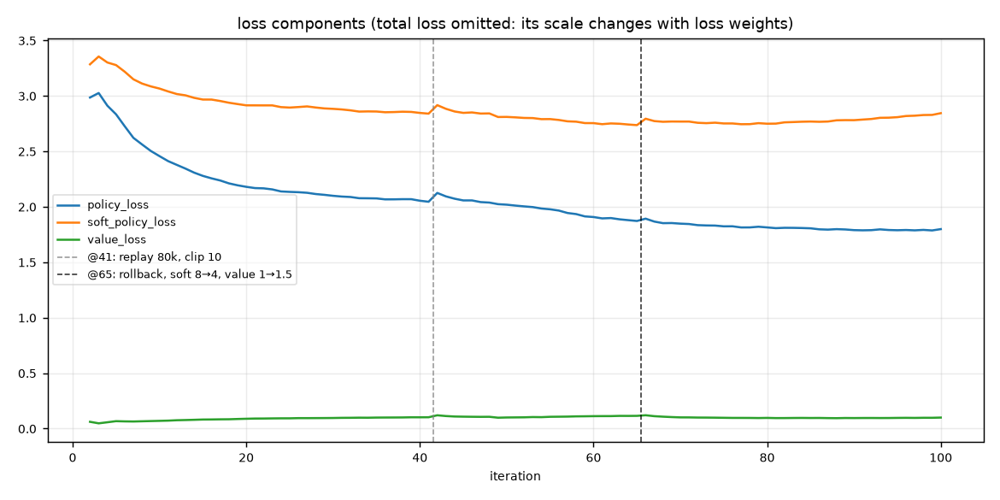
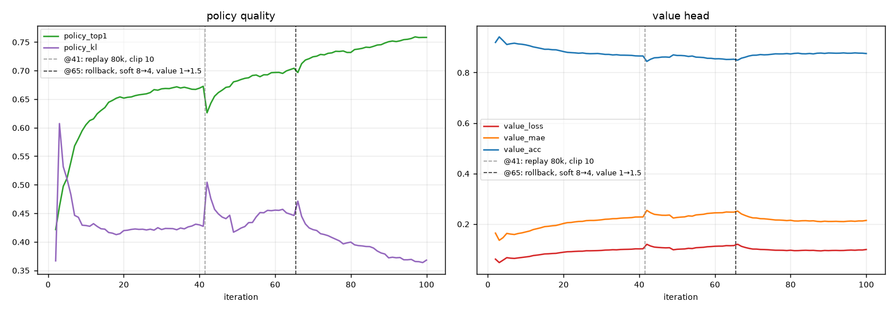
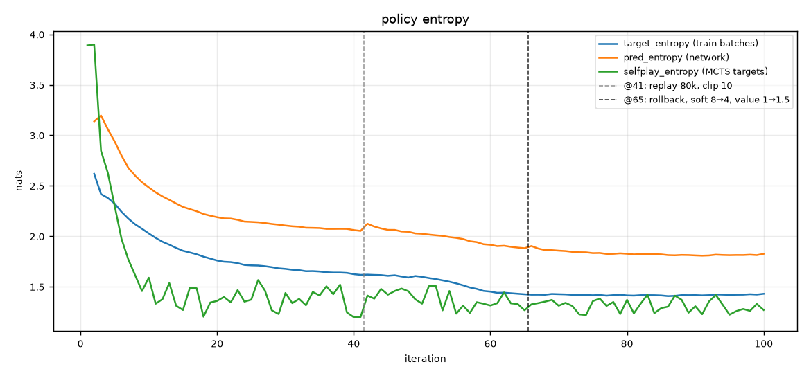
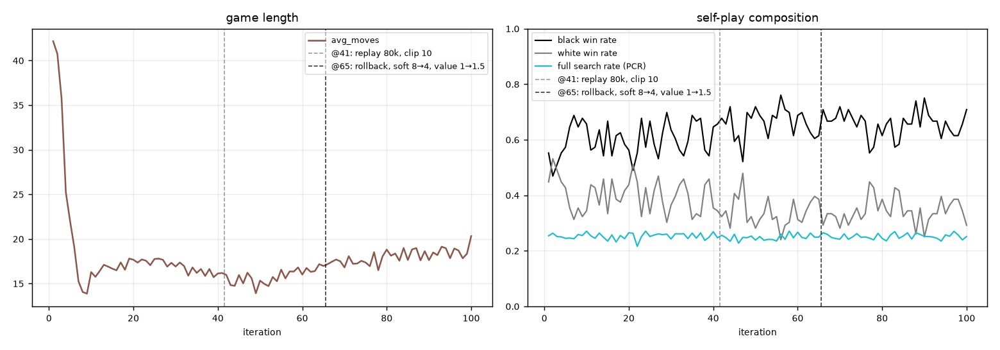
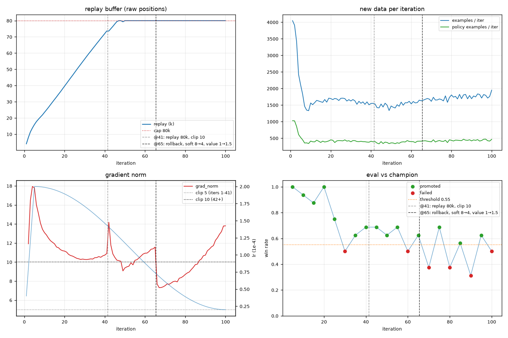

# 10x10 AlphaZero 五子棋

这是一个面向 `10x10` 棋盘的 AlphaZero 风格五子棋训练项目，并移植了多项 [KataGo](https://github.com/lightvector/KataGo) 的训练改进。仓库包含训练代码、单元测试、网页对弈界面和完整 100 轮训练的指标与曲线图；最强模型 `gomoku10_best.pt` 约 115 MB，超出 GitHub 单文件限制，不随仓库分发（详见「当前模型」）。

项目没有写入开局库、活三活四、威胁搜索或人工估值函数。代码里只编码了五子棋环境规则：

- 棋盘大小为 `10x10`；
- 黑白双方轮流在空位落子；
- 任意方向连成五子即获胜；
- 棋盘下满且无人连五则为平局。

策略和价值都由神经网络从自我对弈中学习。

## 项目结构

```text
game.py        五子棋规则、状态转移和胜负判断
mcts.py        MCTS 搜索（含 KataGo 改进）
model.py       Policy-Value 网络（含全局池化、辅助软策略头）
train.py       自我对弈、训练、评估和 checkpoint 保存
utils.py       公共工具（resolve_device, load_model）
play.py        命令行人机对弈
web_play.py    本地网页对弈服务
web/           前端棋盘界面
tests/         单元测试（规则、MCTS、训练组件）
outputs/       checkpoint、metrics、plots
```

## 算法原理

这是一个 AlphaZero 风格的系统：**不学人类棋谱、不写棋类知识，只靠"自己跟自己下棋"从零学会五子棋**。整个系统由三个部件组成一个闭环：

```text
  ┌────────── 训练: 拟合 (局面, 搜索分布 π, 胜负 z) ──────────┐
  │                                                       │
  ▼                                                       │
策略-价值网络 ──先验 P, 估值 v──▶ MCTS 搜索 ──比直觉更强──▶ 自我对弈
 (model.py)                    (mcts.py)               (train.py)
```

闭环成立的关键洞察是：**MCTS 是一个"策略改进算子"**——给定网络当前的水平，搜索之后的落子分布总是不差于网络的直觉。于是把"搜索后的结论"当作监督目标去训练网络，网络的直觉就会逼近搜索结果；直觉变强后，同样模拟数的搜索又能看得更深。如此螺旋上升，不需要任何外部知识。

### 1. 策略-价值网络（model.py）

输入是 `2×10×10` 的两个平面：我方棋子和对方棋子——**始终以当前行棋方的视角编码**（`game.py` 的 `encode()`），所以网络不需要知道自己执黑还是执白，黑白共用同一套参数。

主干是卷积残差塔（`a100-4` 预设：192 通道 × 12 块），每个残差块带 KataGo 式全局池化：把全盘的 avg+max 池化特征经线性层加回每个格子，让卷积的有限感受野也能"看见"全盘（比如远处有没有活三）。塔顶分出两个头：

- **策略头**：输出 100 个落点的 logits——"直觉上该下哪"；
- **价值头**：输出 `tanh` 后的标量 `v ∈ [-1, 1]`——"当前行棋方有多大胜算"。

策略头给搜索提供方向（先看哪些走法），价值头取代传统 MCTS 的随机模拟（rollout）——叶子局面不用随机下完，直接问网络。

### 2. MCTS：被网络引导的树搜索（mcts.py）

每步棋执行若干次模拟（自对弈全量搜索 384 次）。每次模拟四步：

1. **选择**：从根出发，按 PUCT 规则下行到叶子：

   ```text
   score(子节点) = Q + c_puct · P · sqrt(N_父) / (1 + N_子)
   ```

   `Q` 是该走法的平均估值（利用），右边一项随访问次数衰减（探索）：先验 `P` 高的走法先被尝试，被访问得多了探索奖励就让位给实际表现。
2. **展开**：到达未展开的叶子时，用网络一次前向同时取得所有合法走法的先验和叶子估值。
3. **估值**：叶子若是终局，用真实胜负（精确值）；否则用价值头的输出。
4. **回传**：估值沿路径逐层回传，**每上一层取一次反**——因为父节点和子节点的"当前行棋方"是对手关系。这套视角约定贯穿全部代码：任何节点的 `Q` 都是"该节点轮到谁走、谁的胜算"（我们曾在这里栽过一个符号 bug，见复盘）。

搜索结束后，根节点各子节点的**访问次数分布**就是结论：访问越多的走法越好。这个分布有两个用途——按它落子，以及作为训练目标。

### 3. 自我对弈与训练目标（train.py）

自对弈时模型同时扮演双方，每步记录 `(局面, 搜索分布 π, 终局胜负 z)`。为了产生多样化的数据而不是每盘都复读同一局：

- **根节点 Dirichlet 噪声**：往根先验里混入随机噪声，强迫搜索分一部分模拟给冷门走法；
- **温度采样**：前 `temperature_moves` 手按 π 概率采样落子（探索），之后贪心选最优——注意**训练目标始终是 τ=1 的完整分布**，温度只影响落子（见 KataGo 表）。

训练损失由三部分组成：

```text
L = CE(策略头, π)  +  1.5 · MSE(价值头, 目标值)  +  4 · CE(软策略头, π^(1/4))
```

价值目标不是纯胜负，而是 `0.5·z + 0.5·MCTS根节点估值`——纯终局标签方差太大（开局的一手棋和 30 手后的胜负只有微弱因果），混入搜索估值能显著降噪。数据存进 replay buffer（滑动窗口 80k 局面），训练时每个样本随机施加八种对称变换之一。

### 4. 评估与晋升：确认真的变强了

自对弈训练有个著名陷阱：**loss 不可信**。数据分布随模型变强而漂移，loss 走平甚至上升都不代表停滞。所以每 5 轮做一次独立评估：候选模型 vs 当前 champion 打 16 局（随机配对开局、黑白互换），胜率 ≥ 0.55 才晋升为新 champion 并更新 `gomoku10_best.pt`；连续 3 次评估不过线则触发 early stopping。**评估胜率是唯一可信的进步信号**，本项目两次关键调参都是靠它而不是 loss 做的判断。

在这套基础流程之上，我们移植了下面这些 KataGo 改进。

## KataGo 改进

以下改进均可通过 `TrainConfig` 参数独立开关，默认全部关闭以保持向后兼容。`a100-4` 预设会全部开启。

### 神经网络

| 改进 | 参数 | 说明 |
|------|------|------|
| 全局池化 | `use_global_pool` | 残差块内 avg+max 池化 → Linear → 加性通道 bias（KataGo 风格），向每个格子广播全局棋盘信息；`a100-4` 预设用它替代 SE |
| 辅助软策略头 | `use_soft_policy` + `soft_policy_loss_weight` | 第二个 policy head，训练目标 π^(1/T)，加速学习非最优落点；权重实测 `4.0` 比 `8.0` 更稳（过高会淹没价值头梯度，见复盘） |

### MCTS

| 改进 | 参数 | 说明 |
|------|------|------|
| 根节点策略温度 | `mcts_root_policy_temp` | 展开根节点前对先验 logits 除以温度，避免先验过早锐化 |
| 形状化 Dirichlet 噪声 | `mcts_shaped_dirichlet` | 先验高于中位数的落点用更高 alpha，更有针对性地探索潜力走法 |
| 动态方差缩放 cPUCT | `mcts_dynamic_cpuct` | `c_puct` 乘以 `sqrt(实证价值方差)`，自适应探索-利用平衡 |
| FPU reduction | `mcts_fpu_reduction` | 未访问子节点估值 = 父节点估值 − fpu·sqrt(已访问先验质量)，替代过于乐观的 Q=0 初始化；**根节点不应用**（对应 KataGo 的 rootFpuReduction）——否则先验遗漏的关键防守点会被永久冻结，搜索宁可对攻也不去试唯一解 |
| 强制访问 + 目标剪枝 | `mcts_forced_playouts` + `mcts_forced_playout_k` | 根节点每个子节点保底 `sqrt(k·prior·N)` 次访问；生成策略目标时剪掉 PUCT 本身不会花的强制访问 |
| 搜索树复用 | `selfplay_tree_reuse` | 自我对弈相邻两步间复用所选子树，节省大量模拟 |

### 自我对弈与训练数据

| 改进 | 参数 | 说明 |
|------|------|------|
| Playout cap randomization | `playout_cap_randomization` + `full_search_prob` + `fast_simulations` | 每步以概率 p 做全量搜索（产生策略目标），否则做小搜索（只产生价值目标），大幅提高自对弈吞吐 |
| 策略目标/温度解耦 | （内置） | 训练目标始终是 τ=1 的访问分布；采样温度只影响实际落子，后期目标不再塌缩成 one-hot |
| 惊喜加权采样 | `surprise_weighting` | 按 KL(无噪声先验‖MCTS目标) 加权 replay 采样，重点训练网络盲区；KL 随 replay 一起持久化 |
| 短期价值目标 | `mcts_value_weight` | `target = (1-w) * 终局胜负 + w * MCTS根节点估值`，降低纯终局标签的高方差 |
| 训练时对称增强 | `augment_symmetries` | 每个 batch 样本独立施加随机二面体对称变换；replay 只存原始局面，同样内存下独立局面多 8 倍 |

## 当前模型

最强模型是 v3 完整训练（100 轮 + KataGo 全套改进）第 95 轮晋升的 champion：

```text
outputs/checkpoints/a100-4-prod-v3/gomoku10_best.pt   (本地, 约 115 MB)
```

它超过 GitHub 单文件 `100 MB` 硬限制，不随仓库提交（`outputs/checkpoints/` 已加入 `.gitignore`）。仓库内保留的 `gomoku10_iter_0030.pt` 是旧版架构的历史模型，仅作存档。

### v2 失败实验

`v2` 是一次从当前 best 继续训练的远端实验，目标是用更长训练和更低运行搜索预算超过旧 best。结果不成立：训练曲线在 `96 -> 112` 轮持续恶化（`loss` 上升、`policy_top1/value_acc` 下降、`policy_kl` 上升），实战复核也没有稳定超过旧 best。

关键对战结果：

```text
v2 0101 vs old best: 9-7, score 0.5625
v2 0112 vs old best: 8-8, score 0.5000
v2 0096 vs old best: 6-10, score 0.3750
v2 0096 vs v2 0101: 7-9, score 0.4375
```

因此 `v2` 判定为失败实验；`outputs/checkpoints/v2/gomoku10_best_selected.pt` 只代表 v2 内部低样本筛选结果，不代表全局最强。继续训练和部署默认仍以 `outputs/checkpoints/a100-4-prod-v3/gomoku10_best.pt` 为基准。v2 失败实验的曲线和筛选记录保存在：

```text
outputs/plots/v2-failed/
outputs/metrics/v2-failed/
```

## v3 训练复盘

完整 100 轮训练中踩过并修复的问题，按影响排序：

1. **replay 窗口必须按"原始局面数"换算**：对称增强移到训练时后，沿用旧的 `500k` 容量等于把数据窗口拉长 8 倍、整个 run 永不淘汰旧数据。早期弱模型的自举价值标签（`mcts_value_weight`）成为不可拟合的标签噪声，`value_loss` 从 0.047 单调恶化到 0.116。改为 `80k`（约 50 轮窗口）后止住。
2. **soft policy 权重 8.0 过高**：主干梯度被辅助头主导，梯度范数长期超过裁剪阈值，价值头学习信号被淹没。中途（第 65 轮 checkpoint）把 `soft_policy_loss_weight` 降到 `4.0`、`value_loss_weight` 提到 `1.5` 后，`value_acc` 从 0.85 回升至 0.876，policy_top1 不降反升（最终 0.758）。
3. **根节点 FPU bug**：见上表。实战表现为"对手冲四在前时不堵、反做自己的冲四"，128 sims 复现、修复后同局面 105/128 票回归正解。
4. **评估必须随机化**：确定性搜索下 16 局评估实际只有 2 个不同棋局。随机配对开局（黑白互换）修复后，eval_score 才有梯度信息，early stopping 也才可靠。

最终模型实测（人机对弈）：开局走中心、对活二即开始应对、活三大多会堵、冲四必堵、能组织连续活三 + 连环冲四的成体系进攻；剩余弱点是低模拟数下偶发忽视对手活三，**对弈建议 `--simulations 256` 以上**。

## 快速验证训练循环

从项目父目录运行：

```bash
cd /Users/jiaxuanzou/Documents

python -m alphazero_gomoku.train \
  --iterations 1 \
  --games-per-iteration 1 \
  --simulations 4 \
  --epochs 1 \
  --channels 8 \
  --residual-blocks 1
```

这个命令只用于验证训练流程，不会得到强棋力模型。

## 使用 A100 预设训练

在远端 A100 机器上，从 `~/jiaxuanzou` 运行（自动开启全部 KataGo 改进）：

```bash
cd ~/jiaxuanzou
conda activate modded-nanogpt

python -m alphazero_gomoku.train \
  --preset a100-4 \
  --checkpoint-dir alphazero_gomoku/outputs/checkpoints/a100-4-prod-v3 \
  --replay-path alphazero_gomoku/outputs/replay/a100-4-prod-v3_replay.pt \
  --metrics-path alphazero_gomoku/outputs/metrics/a100-4-prod-v3.jsonl
```

`a100-4` 预设使用更大的 ResNet + 全局池化 + 软策略头、固定每轮训练步数、cosine learning-rate schedule、16 个并行自我对弈 worker，以及全套 KataGo MCTS 和训练改进。

replay 窗口为 `80k` 原始局面（约 50 轮）。注意 replay 现在只存原始局面（对称增强在训练时进行），窗口长度不要按旧版 8 倍增强的尺度设置，否则早期弱模型产生的陈旧价值标签（`mcts_value_weight` 自举部分）会一直留在 buffer 里拖累价值头。

候选模型评估使用随机配对开局：每个随机开局（`eval_opening_moves` 步，默认 2）打两盘、候选模型黑白互换，既消除确定性搜索导致的重复对局，又抵消先手优势。

### Early stopping

自我对弈训练中 loss 走平不代表停滞（数据分布随模型变强而漂移），真正的停滞信号是评估胜率。`early_stop_evals` 设为 `N` 时（`a100-4` 预设为 3），候选模型连续 `N` 次评估打不过 champion 就提前结束训练并保存 replay，避免浪费算力。需要同时开启 `eval_interval` 和 `eval_games`。

配套语义：`gomoku10_best.pt` 在开启评估时只在候选真实晋升时更新（即始终指向 champion 一系的最强模型）；未开启评估时保持旧行为（跟踪最新 checkpoint）。

## v3 推荐路线：old best 蒸馏轻量 student

不要直接从 old best 继续长训。先用 old best 蒸馏一个更轻的 student，再让 student 进入 KataGo-style RL。

第一步，生成 teacher 数据并训练轻量 student：

```bat
scripts\distill_old_best_light.cmd
```

默认输出：

```text
outputs/checkpoints/distill-oldbest-128x8/gomoku10_student_best.pt
outputs/checkpoints/distill-oldbest-128x8/gomoku10_student_final.pt
outputs/metrics/distill-oldbest-128x8.jsonl
outputs/logs/distill_oldbest_light.out.log
outputs/logs/distill_oldbest_light.err.log
```

快速烟测可以只跑极小数据量：

```bat
scripts\distill_old_best_light.cmd --games 2 --epochs 1 --batch-size 32 --device cpu
```

如果 raw policy/value 蒸馏后的 benchmark 仍明显落后，先用 old best MCTS targets 继续微调，不要直接进入 RL：

```bat
scripts\distill_old_best_light.cmd ^
  --student-resume outputs\checkpoints\distill-oldbest-128x8\gomoku10_student_best.pt ^
  --checkpoint-dir outputs\checkpoints\distill-oldbest-128x8 ^
  --metrics-path outputs\metrics\distill-oldbest-128x8.jsonl ^
  --channels 128 ^
  --residual-blocks 8 ^
  --policy-channels 12 ^
  --value-channels 6 ^
  --value-hidden 384 ^
  --games 512 ^
  --random-opening-moves 8 ^
  --teacher-sims 64 ^
  --mcts-target-prob 0.25 ^
  --epochs 16 ^
  --batch-size 1024 ^
  --learning-rate 1e-4
```

第二步，只有当 student 通过 benchmark 后，才启动 student RL：

```bash
python -m alphazero_gomoku.train --preset v3-student-local
```

也可以使用 Windows 启动脚本：

```bat
scripts\train_v3_student_local.cmd
```

`v3-student-local` 使用 `128` channels、`8` 个 residual blocks、全局池化和软策略头，比 old best 的 `192x12` 更轻。RL 阶段仍保留 KataGo 风格的 root policy temperature、shaped Dirichlet、dynamic cPUCT、FPU、forced playouts、playout cap randomization、随机开局评估和 champion gate。它还会在 replay 低于 `25k` 原始局面时跳过训练，并把每轮训练步数限制为最多扫 replay `2` 遍，避免 v2 那种小 replay 反复拟合。

进入 RL 前至少跑一次：

```bash
python alphazero_gomoku/scripts/benchmark_checkpoints.py \
  --candidate alphazero_gomoku/outputs/checkpoints/distill-oldbest-128x8/gomoku10_student_best.pt \
  --baseline alphazero_gomoku/outputs/checkpoints/a100-4-prod-v3/gomoku10_best.pt \
  --candidate-sims 256 \
  --baseline-sims 256 \
  --games 16
```

如果这个 benchmark 低于约 `0.45`，继续蒸馏或调整 student 容量；不要启动 `v3-student-local`。

当前 128x8 student 已通过准入预检：`256` sims 对 old best `256` sims，16 盘 `8-8`，score `0.50`。

## 使用本地 RTX 3080 启动旧 v3 预设

旧的 `v3-local` 预设会从 old best 直接继续训练，目前不作为推荐路线。保留它只是为了复现实验；推荐先走上面的 distill -> `v3-student-local`。

```bat
scripts\train_v3_local.cmd
```

也可以直接运行：

```bash
python -m alphazero_gomoku.train --preset v3-local
```

本地 v3 输出路径：

```text
outputs/checkpoints/v3-local/
outputs/replay/v3-local_replay.pt
outputs/metrics/v3-local.jsonl
outputs/logs/v3_local_train.out.log
outputs/logs/v3_local_train.err.log
```

从已有 checkpoint 继续训练（checkpoint 必须由相同网络架构配置产出；`gomoku10_best.pt` 等 v3 产物可直接 resume，仓库内存档的 `gomoku10_iter_0030.pt` 是旧版架构、不能用新预设 resume）：

```bash
python -m alphazero_gomoku.train \
  --preset a100-4 \
  --resume <checkpoint 路径> \
  --checkpoint-dir <相同目录> \
  --replay-path <相同 replay 路径> \
  --metrics-path <相同 metrics 路径>
```

## 命令行对弈

```bash
cd /Users/jiaxuanzou/Documents

python -m alphazero_gomoku.play \
  alphazero_gomoku/outputs/checkpoints/a100-4-prod-v3/gomoku10_best.pt \
  --simulations 256 \
  --human white
```

人类固定执白后手，AI 执黑先行。行列坐标均从 `1` 开始。

## Benchmark lower search budgets

Use this to verify whether a candidate checkpoint actually beats the current
best at a target runtime search budget:

```bash
python alphazero_gomoku/scripts/benchmark_checkpoints.py \
  --candidate alphazero_gomoku/outputs/checkpoints/v3-local/gomoku10_iter_0100.pt \
  --baseline alphazero_gomoku/outputs/checkpoints/a100-4-prod-v3/gomoku10_best.pt \
  --candidate-sims 128,256,512 \
  --baseline-sims 512 \
  --games 32 \
  --device cuda
```

Do not use loss curves alone to promote a checkpoint. The promotion signal is
paired-opening head-to-head score against the current champion.

## 本地网页对弈

```bash
cd /Users/jiaxuanzou/Documents

python -m alphazero_gomoku.web_play \
  alphazero_gomoku/outputs/checkpoints/a100-4-prod-v3/gomoku10_best.pt \
  --simulations 256
```

然后打开：

```text
http://127.0.0.1:8765
```

界面支持悔棋（Undo）和局面分析（Analyze）。

## 训练曲线

下面的图来自 v3 完整训练的 `outputs/metrics/a100-4-prod-v3.jsonl`（100 轮，4×A100，总耗时约 `13.2` 小时）。所有图中的两条虚线是两次训练中干预：

- **@41**（灰）：replay 窗口 `500k → 80k`、梯度裁剪 `5 → 10`；
- **@65**（黑）：从第 65 轮 checkpoint 回滚重启，`soft_policy_loss_weight 8 → 4`、`value_loss_weight 1 → 1.5`（第 66-70 轮的废弃分支不在图中）。

### 总览


### 损失曲线



`policy_loss` 从 `2.99` 稳定降到 `1.80`。注意交叉熵的下限是目标分布的熵：τ=1 软目标下 `policy_loss ≈ target_entropy + policy_kl`，所以绝对值不会趋近 0，真正反映拟合差距的是 `policy_kl`（`0.37` 收敛）。总损失未画出——两次损失权重调整后它的量纲不可比。第 1 轮没有训练数据点：当时 replay 小于一个 batch、整轮被跳过（这个 bug 后来已修复）。

### 策略和值网络指标



`policy_top1` 从 `0.42` 一路升到 `0.758`，到第 100 轮仍未平台化。

`value_loss` 是这次训练最重要的故事线：从第 3 轮的 `0.047` 单调恶化到第 65 轮的 `0.116`（根因是 replay 窗口换算错误 + soft policy 权重过高，见「v3 训练复盘」），@65 干预后回落到 `0.094` 并企稳，终值 `0.099`；`value_acc` 对应从 `0.94 → 0.85 → 0.876` 走出 V 形恢复。

### 熵和策略确定性



`selfplay_entropy`（MCTS 目标的熵）从 `3.9` 降到约 `1.3`；`pred_entropy` 与 `target_entropy` 的差距持续收窄但不归零——策略目标/采样温度解耦后，目标保留了 τ=1 的搜索分歧，不再塌缩成 one-hot。

### 自我对弈结果



平均步数先从 `42` 降到中段的 `14-15`（攻强守弱的速决战阶段），价值头恢复后回升到 `18-20`——防守能力成型让棋局重新变长，这是比损失更有说服力的行为证据。黑棋胜率全程在 `0.65` 上下，先手优势仍然显著但未失控。`full_search_rate` 稳定在 `0.25`，与 playout cap randomization 的配置一致。

### 数据量、耗时和评估



replay 在第 47 轮触及 `80k` 上限后开始滑动淘汰。`grad_norm` 在 @65 之前长期高于裁剪阈值（等效学习率被打折），降低 soft 权重后回到阈值以下。

评估（随机配对开局，每 5 轮 16 局）：晋升发生在第 `45/50/55/65/75/85/95` 轮，失败在第 `60/70/80/90/100` 轮——后期"晋升一次、失败一次"的锯齿是收敛末期的典型形态。**最终最强模型是第 95 轮**（`gomoku10_best.pt`），第 100 轮候选对它战成 `0.5`，恰好停在天花板上。

完整数值表导出在：

```text
outputs/plots/a100-4-prod-v3/metrics.csv
```

重新生成任意一次训练的曲线：

```bash
python alphazero_gomoku/scripts/plot_training_metrics.py \
  --metrics alphazero_gomoku/outputs/metrics/v3-local.jsonl \
  --out-dir alphazero_gomoku/outputs/plots/v3-local
```

## 测试

从项目父目录运行：

```bash
cd /Users/jiaxuanzou/Documents

python -m unittest discover -s alphazero_gomoku/tests -t .
```

覆盖内容：五子棋规则与终局判定、MCTS 必胜局面与根节点估值符号、策略目标剪枝、树复用、随机对称增强的状态-策略一致性、训练循环边界条件、replay v2 格式与旧格式兼容加载。

## GitHub Pages 静态版

`docs/` 目录是无需后端服务器的静态对弈版本，适合直接部署到 GitHub Pages。它把当前最佳 checkpoint 导出为 ONNX，并在浏览器里用 ONNX Runtime Web 执行神经网络和 MCTS。

本地重新导出模型：

```powershell
conda run -n alphazero-gomoku python scripts\export_pages_model.py --checkpoint outputs\checkpoints\a100-4-prod-v3\gomoku10_best.pt --out-dir docs\assets\model --chunk-mib 24
```

本地预览静态版：

```powershell
conda run -n alphazero-gomoku python -m http.server 8780 --bind 127.0.0.1 --directory docs
```

然后打开 <http://127.0.0.1:8780/>。部署到 GitHub Pages 时，在仓库 Settings -> Pages 里选择从分支发布，并把目录设为 `/docs`。静态版会从 `docs/assets/model/manifest.json` 读取模型分片，不需要 `web_play.py`、Python 服务或 GPU 后端。
