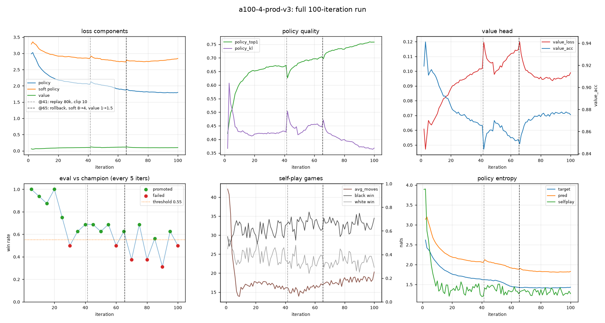
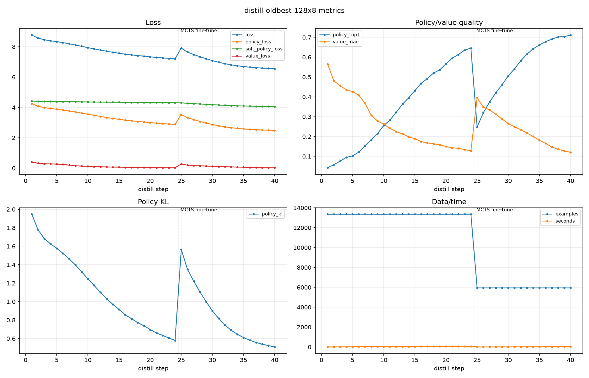

# 10x10 AlphaZero 五子棋

面向 `10x10` 棋盘的 AlphaZero 风格五子棋项目：自我对弈、神经网络引导的 MCTS、训练、蒸馏、checkpoint 对战评估，以及一个无需后端的 GitHub Pages 浏览器对弈页面。

网络只看棋盘黑白两层，不注入任何定式或人工规则。

## 快速开始

```bash
# 1) 创建并激活环境（conda）
conda env create -f environment.yml
conda activate alphazero-gomoku

# 2) 安装本项目（可选，但推荐：装好后任意目录都能 import，省去 PYTHONPATH）
pip install -e .

# 3) 跑测试
python -m unittest discover -s tests -t .

# 4) 和 baseline 对弈（人类执白后手，AI 执黑先行）
python -m alphazero_gomoku.play \
  outputs/checkpoints/v1-old-best/gomoku10_best.pt \
  --simulations 256 --human white

# 5) 跑一个小训练（CPU 也能跑通流程）
python -m alphazero_gomoku.train --preset local --iterations 2
```

> 没有 `pip install -e .` 也可以运行：从仓库**父目录**执行并设置 `PYTHONPATH`（见下文“测试”）。脚本里保留了 `sys.path` 兜底，安装后会自动走正常 import。

依赖：`numpy`、`torch`（核心）；`matplotlib`（画曲线）、`onnx`（导出 Pages 模型）为可选。GPU 用户请按 [pytorch.org](https://pytorch.org/get-started/locally/) 安装匹配 CUDA 的 torch。

## 项目结构

```text
game.py        五子棋规则、状态转移、胜负判断（不可变 GomokuState）
model.py       policy-value 残差网络（可选 SE / global pooling / soft policy 头）
mcts.py        神经网络引导的 MCTS（batch 评估、树复用、KataGo 改进）
inference.py   共享推理工具：从 checkpoint 配置构建 MCTSConfig、贪心走子、随机开局
train.py       自我对弈、训练、gate 评估、checkpoint；preset 配置都在这里
play.py        命令行人机对弈
utils.py       设备解析、模型加载、状态字典、计时等公共工具
torch_compat.py  跨 torch/numpy 版本兼容 + 统一的 autocast 上下文
scripts/       画图、benchmark、蒸馏、Pages 导出
docs/          GitHub Pages 静态页面（onnxruntime-web 浏览器推理）和版本记录
tests/         单元测试
outputs/       本地训练产物：checkpoints / metrics / plots / replay
```

## 全链路概览

```text
self-play (MCTS)  ->  replay buffer  ->  train (policy+value)  ->  champion gate
      ^                                                                  |
      |                              promote if it beats champion        v
      +------------------------- best checkpoint  ---------------------> +
                                         |
                                         v
        scripts/export_pages_model.py  ->  ONNX 分块 + manifest + catalog
                                         |
                                         v
        docs/  (onnxruntime-web 在浏览器里跑 MCTS + 推理)
```

- **self-play**：每步用 MCTS 搜索；KataGo 的 playout cap randomization 让多数步走便宜搜索（只训 value 头），少数步走全搜索产生 policy target。
- **训练**：从 replay 采样，policy + value（+ 可选 soft policy）联合损失；采样时做随机对称增强。
- **晋升**：只靠 loss 曲线不晋升 checkpoint，必须通过 champion gate + 独立 head-to-head（随机开局、黑白互换）。详见 [docs/VERSION_HISTORY.md](docs/VERSION_HISTORY.md) 的“checkpoint 晋升规则”。
- **导出**：`export_pages_model.py` 把 PyTorch checkpoint 转 ONNX，按 `--chunk-mib` 切成 `*.onnx.part*`（绕开 GitHub 100MB 单文件限制），并写 `manifest.json`（含每块 sha256）和 `catalog.json`（驱动前端的模型选择器）。

## 当前状态

正式 baseline（**通过 Git LFS 随仓库分发**，约 `115 MB`）：

```text
outputs/checkpoints/v1-old-best/gomoku10_best.pt
```

`v1-old-best` 历史目录名曾是 `a100-4-prod-v3`，现已重命名以消除“看着像 v3、其实是 v1”的混淆。晋升的是第 `95` 轮的 best（共训 `100` 轮）。

当前主线 v3：从蒸馏得到的 `128x8` student 出发再做大规模 self-play RL，通过内部 gate 的 best（第 `90` 轮，不是最后保存的 `iter_0096.pt`）：

```text
outputs/checkpoints/v3-student-local/gomoku10_best.pt
```

最新对 old best 的 `128 sims` 复核为 `54-10-0`（score `0.84375`），已明显强于 v1 的 `128 sims` 设置。各版本的完整结果、数字与晋升判据统一记录在 [docs/VERSION_HISTORY.md](docs/VERSION_HISTORY.md)，本文不再重复。

## 训练

```bash
python -m alphazero_gomoku.train --preset <preset> [--device cuda] [其它覆盖项]
```

可用 preset（定义见 `train.py` 的 `PRESETS`）：

| preset | 用途 |
|--------|------|
| `local` | 极小配置，本地冒烟测试整条流程 |
| `v4-student-3080` | warm-start v3 + ownership/EMA/开局多样化，本地 3080 续训（与 v3 持平、色彩更均衡） |
| `v3-student-local` | 当前主线：从 128x8 student 起步做 RL |
| `v3-local` | 从 old best 直接继续 RL（归档复现路线） |
| `v2` | 长训续训实验（已判失败，保留复现） |
| `a100-4` / `a100-prod` / `a100-fast` / `a100-turbo` | 不同规模/时长的 A100 配置 |

任意字段都可用命令行覆盖（如 `--simulations`、`--self-play-workers`、`--eval-interval`）。多 worker self-play / eval 在所有平台都走进程隔离（spawn），保证真并行且每个 worker 的随机种子独立。

## 训练曲线

用 `scripts/plot_training_metrics.py` 从 `.jsonl` 指标生成图：

```bash
python scripts/plot_training_metrics.py \
  --metrics outputs/metrics/v3-student-a100-final.jsonl \
  --out-dir outputs/plots/v3-student-a100-final
```

> 指标 `.jsonl` 属于本地训练产物（默认不入库）；仓库里提交的是生成好的 PNG 方便查看。`v3-student-a100-final` 是 `v3-student-local` preset 在 A100 上的远端导出，其冠军即 `v3-student-local/gomoku10_best.pt`。

### v1 / old best



更多图在 `outputs/plots/v1-old-best/`（`losses.png`、`accuracy_value.png`、`entropy.png`、`selfplay_outcomes.png`、`data_timing_eval.png`）。

### distill / 128x8 student



蒸馏分两段：前 `24` 步 raw distill，后 `16` 步 MCTS fine-tune。

### v3 / student RL


诊断要点：replay 达标后训练才真正开始；真实训练阶段 loss 和 policy KL 整体下降；eval 波动大，不能只靠曲线晋升。

## 测试

装好包后（`pip install -e .`）直接：

```bash
python -m unittest discover -s tests -t .
```

未安装时从仓库**父目录**运行，保证 `alphazero_gomoku` 包可导入：

```powershell
cd ..
$env:PYTHONPATH = (Get-Location).Path
conda run -n alphazero-gomoku python -m unittest discover -s alphazero_gomoku\tests -t .
```

## 命令行对弈

```bash
python -m alphazero_gomoku.play \
  outputs/checkpoints/v1-old-best/gomoku10_best.pt \
  --simulations 256 --human white
```

人类执白后手，AI 执黑先行。

## checkpoint 对战评估

不要只看 loss 曲线晋升模型。正式比较必须做 head-to-head（随机开局、交替黑白）：

```bash
python scripts/benchmark_checkpoints.py \
  --candidate outputs/checkpoints/v3-student-local/gomoku10_best.pt \
  --baseline outputs/checkpoints/v1-old-best/gomoku10_best.pt \
  --candidate-sims 128,256,512 \
  --baseline-sims 128 \
  --games 64 \
  --opening-moves 4 \
  --device cuda
```

## GitHub Pages 静态页面

`docs/` 是纯静态页面（无 Python 后端），用 onnxruntime-web 在浏览器里跑模型，可在页面切换对战 `v3 student`（默认）、`v4 student` 或 `v1 / old best`。模型按 `docs/assets/models/<id>/` 统一存放，分块文件 + `manifest.json` 由 `catalog.json` 索引（`defaultModel` 决定默认加载哪个）。

导出一个模型（`--out-dir` 省略时自动推导为 `docs/assets/models/<model-id>`）：

```powershell
conda run -n alphazero-gomoku python scripts\export_pages_model.py `
  --checkpoint outputs\checkpoints\v1-old-best\gomoku10_best.pt `
  --model-id v1 --model-label "v1 / old best" `
  --catalog docs\assets\models\catalog.json --chunk-mib 24

conda run -n alphazero-gomoku python scripts\export_pages_model.py `
  --checkpoint outputs\checkpoints\v3-student-local\gomoku10_best.pt `
  --model-id v3 --model-label "v3 student" `
  --catalog docs\assets\models\catalog.json --chunk-mib 24
```

本地预览：

```powershell
conda run -n alphazero-gomoku python -m http.server 8780 --bind 127.0.0.1 --directory docs
# 打开 http://127.0.0.1:8780/
```

## 版本记录

各训练/基础设施版本的目标、改动、结果与晋升判据：[docs/VERSION_HISTORY.md](docs/VERSION_HISTORY.md)。
前端产品设计说明见 [PRODUCT.md](PRODUCT.md)。
